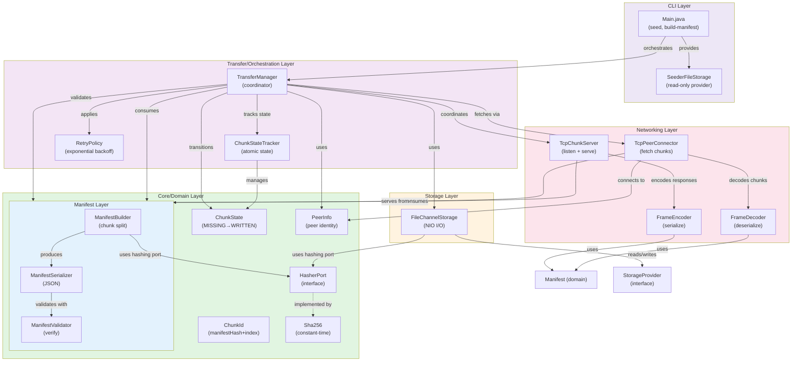

# swarm-share-lite — Complete Design, Implementation & Java Reference

> **Project Codename:** `swarm-share-lite`
> **Language:** Java 25 (Virtual Threads, Records, Sealed Classes, Pattern Matching)
> **Platform:** Linux (Ubuntu / Fedora)
> **Philosophy:** Learn Distributed Systems by Building One. Simple Design. Extensible Boundaries.

---

## Table of Contents

1. [Vision & Goals](#1-vision--goals)
2. [Core Concepts Explained](#2-core-concepts-explained)
3. [Architecture & Clean Boundaries](#3-architecture--clean-boundaries)
4. [Domain Model — Full Code](#4-domain-model--full-code)
5. [Port Interfaces — Extensibility Contracts](#5-port-interfaces--extensibility-contracts)
6. [Chunk Lifecycle State Machine](#6-chunk-lifecycle-state-machine)
7. [Storage Layer](#7-storage-layer)
8. [Networking & Wire Protocol](#8-networking--wire-protocol)
9. [Concurrency Model](#9-concurrency-model)
10. [Transfer Orchestration](#10-transfer-orchestration)
11. [Resilience & Retry](#11-resilience--retry)
12. [Manifest Builder & Serialization](#12-manifest-builder--serialization)
13. [CLI Entry Points](#13-cli-entry-points)
14. [Project Structure](#14-project-structure)
15. [Build Configuration](#15-build-configuration)
16. [Testing Strategy](#16-testing-strategy)
17. [Phased Roadmap](#17-phased-roadmap)
18. [Java Feature Refresher](#18-java-feature-refresher)
19. [Design Patterns Used](#19-design-patterns-used)
20. [Known Hard Problems & Solutions](#20-known-hard-problems--solutions)
21. [Learning Curriculum Map](#21-learning-curriculum-map)

---

## System Architecture Diagram



**Dependency Flow:**
- **CLI** → Commands invoke `TransferManager`
- **Transfer** → Orchestrates all other layers, manages state and backpressure
- **Networking** → Implements peer communication via TCP binary protocol
- **Storage** → Provides random-access I/O for partial downloads and resume
- **Manifest** → Splits files into chunks, validates integrity
- **Core** → Domain model (zero I/O, zero dependencies) — all other layers depend inward only

---

## 1. Vision & Goals

### The Problem

Copying large files across many machines is a serial bottleneck when only one or two sources exist. A 300 GB game on 2 machines in a 14-machine LAN: naive approach takes 13× the transfer time of a single copy.

### The Insight

**Every receiver becomes a sender.** As soon as a node receives and verifies a chunk, it can serve that chunk to other nodes. Transfer time scales **logarithmically** with peer count rather than linearly.

```
Round 1:  [A] ──50%──► [B]   [A] ──50%──► [C]       (2 sources → 2 new nodes)
Round 2:  [A][B][C] each serve different peers        (3 sources → 3 new nodes in parallel)
Round 3:  6 sources ...
```

### Goals

- Split large files into fixed-size chunks and assemble them seamlessly
- Verify data integrity with SHA-256 per chunk and for the whole file
- Coordinate concurrent downloads from multiple peers using Virtual Threads
- Handle failures gracefully and support resume from partial downloads
- Strict clean architecture: business logic never touches networking or disk directly

### Non-Goals (v1)

- No DHT / tracker-less peer discovery — static peer list only
- No NAT traversal
- No TLS / encryption (interface boundary exists for future addition)
- No GUI — CLI only

---

## 2. Core Concepts Explained

### What is a Chunk?

A chunk is a fixed-size slice of the original file, stored as raw bytes. The last chunk may be smaller than the nominal size.

```
File (10 MB, chunkSize = 1 MB):

 ┌────────┬────────┬────────┬────────┬────────┬────────┬────────┬────────┬────────┬────────┐
 │Chunk 0 │Chunk 1 │Chunk 2 │Chunk 3 │Chunk 4 │Chunk 5 │Chunk 6 │Chunk 7 │Chunk 8 │Chunk 9 │
 │ 1 MB   │ 1 MB   │ 1 MB   │ 1 MB   │ 1 MB   │ 1 MB   │ 1 MB   │ 1 MB   │ 1 MB   │ 1 MB   │
 └────────┴────────┴────────┴────────┴────────┴────────┴────────┴────────┴────────┴────────┘
  offset=0  offset=  offset=  ...                                                  offset=9MB
            1048576  2097152
```

Each chunk has:
- An **index** (0-based position)
- A **byte offset** in the original file
- A **size** in bytes
- A **SHA-256 checksum** of its raw bytes

### What is a Manifest?

The manifest is a JSON file that describes the entire transfer. It is the "contract" of the swarm — all peers must agree on the same manifest to participate.

```json
{
  "fileHash": "e3b0c44298fc1c149afbf4c8996fb924...",
  "fileName":  "ubuntu-25.04.iso",
  "totalSize": 1073741824,
  "chunkSize": 1048576,
  "chunks": [
    { "index": 0, "offset": 0,       "size": 1048576, "sha256": "abc123..." },
    { "index": 1, "offset": 1048576, "size": 1048576, "sha256": "def456..." },
    ...
  ]
}
```

### What is a Peer?

A peer is any node in the swarm. Every peer:
- Has a stable `UUID` identity
- Listens on a TCP port to **serve** chunks it holds
- Connects to other peers as a TCP client to **download** missing chunks
- Maintains a `BitSet` of which chunk indices it currently holds

### What is a BitSet?

`java.util.BitSet` is a compact data structure where each bit represents a boolean — in our case, whether a peer holds a specific chunk index.

```
Peer holds chunks 0, 2, 3, 7:
BitSet: 1 0 1 1 0 0 0 1 0 0 ...
index:  0 1 2 3 4 5 6 7 8 9 ...
```

When peers exchange BitSets over the wire, a leecher can determine exactly which peers have which chunks and plan downloads without redundant requests.

---

## 3. Architecture & Clean Boundaries

### The Dependency Rule

```
Core Domain (pure Java, no I/O)
    ↑ implements
Infrastructure (TCP, FileChannel, etc.)
```

The domain defines **interfaces** (ports). Infrastructure provides **implementations** (adapters). The domain never imports infrastructure classes. This is the **Ports & Adapters** pattern (Hexagonal Architecture).

```
┌─────────────────────────────────────────────────────────────────────────┐
│                          TransferManager                                │
│                       (System Orchestrator)                             │
└──────────────┬──────────────────────────┬───────────────────────────────┘
               │                          │
       ┌───────▼────────┐        ┌────────▼────────┐
       │  PeerConnector  │        │ StorageProvider  │
       │  <<interface>>  │        │  <<interface>>   │
       └───────┬─────────┘        └────────┬─────────┘
               │ implements                │ implements
       ┌───────▼─────────┐        ┌────────▼─────────┐
       │  TcpPeerConnector│        │FileChannelStorage│
       │  (networking/)  │        │   (storage/)     │
       └─────────────────┘        └──────────────────┘

Core Domain (core/)
├── domain/     ← ChunkId, Manifest, PeerInfo, TransferResult (pure Records)
└── port/       ← StorageProvider, PeerConnector (interfaces only)
```

### Why This Matters

- You can test `TransferManager` with a fake in-memory `StorageProvider` and `PeerConnector` — no disk, no network needed in tests
- You can swap `TcpPeerConnector` for `TlsPeerConnector` later without touching orchestration code
- Each layer compiles independently — circular dependencies are architecturally impossible

---

## 4. Domain Model — Full Code

All domain types are Java **Records** — immutable, auto-`equals`/`hashCode`/`toString`, no boilerplate.

```java
// core/domain/ChunkId.java
package io.swarmshare.core.domain;

/**
 * Globally unique identity for a chunk.
 * The manifestHash ties it to a specific file transfer.
 * Two chunks with the same index but different manifests are completely different objects.
 */
public record ChunkId(String manifestHash, int index) {
    // Compact constructor for validation
    public ChunkId {
        if (manifestHash == null || manifestHash.isBlank())
            throw new IllegalArgumentException("manifestHash must not be blank");
        if (index < 0)
            throw new IllegalArgumentException("index must be >= 0");
    }
}
```

```java
// core/domain/ChunkDescriptor.java
package io.swarmshare.core.domain;

/**
 * Describes one chunk within a manifest.
 * Immutable — created once by the seeder, consumed by all peers.
 */
public record ChunkDescriptor(
    ChunkId id,
    long offset,   // byte offset in original file
    int size,      // byte count (may be < chunkSize for the last chunk)
    String sha256  // expected SHA-256 hex checksum of this chunk's raw bytes
) {
    public ChunkDescriptor {
        if (offset < 0) throw new IllegalArgumentException("offset must be >= 0");
        if (size <= 0)  throw new IllegalArgumentException("size must be > 0");
    }
}
```

```java
// core/domain/Manifest.java
package io.swarmshare.core.domain;

import java.util.List;

/**
 * The contract of a swarm. Immutable once created by the seeder.
 * Distributed to all peers before any chunk transfer begins.
 * fileHash is SHA-256 of the entire assembled file — final integrity check.
 */
public record Manifest(
    String fileHash,
    String fileName,
    long totalSize,
    int chunkSize,
    List<ChunkDescriptor> chunks
) {
    public Manifest {
        chunks = List.copyOf(chunks); // defensive copy, ensures immutability
    }

    public int totalChunks() { return chunks.size(); }

    /** Convenience: look up a descriptor by chunk index. O(1) by list index. */
    public ChunkDescriptor chunkAt(int index) { return chunks.get(index); }
}
```

```java
// core/domain/PeerInfo.java
package io.swarmshare.core.domain;

import java.net.InetSocketAddress;
import java.util.UUID;

/**
 * Identity and address of a swarm participant.
 * UUID is stable across reconnects (read from config or generated once on first run).
 */
public record PeerInfo(UUID id, InetSocketAddress address) {
    public String displayAddress() {
        return address.getHostString() + ":" + address.getPort();
    }
}
```

```java
// core/domain/ChunkState.java
package io.swarmshare.core.domain;

/**
 * The lifecycle state of a single chunk during transfer.
 * States transition monotonically (no going backwards except MISSING on failure).
 */
public enum ChunkState {
    MISSING,     // Not yet downloaded; needs to be fetched
    SCHEDULED,   // Assigned to a virtual thread for download
    IN_FLIGHT,   // Active network I/O in progress
    VERIFYING,   // SHA-256 being computed
    VERIFIED,    // Hash matched; safe to write
    WRITTEN      // Persisted to disk; bit set in BitSet
}
```

```java
// core/domain/TransferResult.java
package io.swarmshare.core.domain;

/**
 * Sealed result type for a single chunk download attempt.
 * The compiler forces exhaustive handling via pattern matching.
 * shouldRetry=true signals the orchestrator to re-queue the chunk.
 */
public sealed interface TransferResult
    permits TransferResult.Success, TransferResult.Failure {

    record Success(ChunkId id, byte[] data) implements TransferResult {}

    record Failure(ChunkId id, String reason, boolean shouldRetry)
        implements TransferResult {}
}
```

---

## 5. Port Interfaces — Extensibility Contracts

These two interfaces are the only surface area between the domain and the outside world. Everything pluggable goes here.

```java
// core/port/StorageProvider.java
package io.swarmshare.core.port;

import io.swarmshare.core.domain.ChunkId;
import io.swarmshare.core.domain.Manifest;

import java.util.BitSet;
import java.util.Optional;

/**
 * Abstracts all persistent storage operations.
 *
 * Implementations:
 *   - FileChannelStorage  (production: direct file I/O)
 *   - InMemoryStorage     (testing: byte arrays, no disk)
 *
 * The domain never calls FileChannel, Path, or Files directly.
 */
public interface StorageProvider {

    /**
     * Pre-allocate the output file to totalSize bytes on disk.
     * This avoids fragmentation and allows out-of-order writes.
     * Called once before any chunks are written.
     */
    void preallocateSpace(long totalSize);

    /**
     * Write raw chunk bytes to the correct byte offset in the output file.
     * Must be safe to call concurrently from multiple virtual threads
     * as long as different chunks are being written simultaneously.
     */
    void writeChunk(ChunkId id, long offset, byte[] data);

    /**
     * Read raw chunk bytes from disk for serving to a remote peer.
     * Returns empty if the chunk has not been written yet.
     */
    Optional<byte[]> readChunk(ChunkId id, long offset, int size);

    /**
     * Scan the output file on startup to determine which chunks
     * are already complete (for resume support).
     * Returns a BitSet where bit[i] = true means chunk i is verified on disk.
     */
    BitSet checkExistingChunks(Manifest manifest);
}
```

```java
// core/port/PeerConnector.java
package io.swarmshare.core.port;

import io.swarmshare.core.domain.ChunkId;
import io.swarmshare.core.domain.PeerInfo;

import java.util.BitSet;
import java.util.concurrent.CompletableFuture;

/**
 * Abstracts all outgoing peer communication.
 *
 * Implementations:
 *   - TcpPeerConnector    (production: raw TCP binary framing)
 *   - FakePeerConnector   (testing: in-memory byte arrays)
 *
 * All methods return CompletableFuture to allow the orchestrator
 * to submit many concurrent requests without blocking the caller.
 * Each future runs on a virtual thread inside the implementation.
 */
public interface PeerConnector {

    /**
     * Request a specific chunk from a remote peer.
     * Returns the raw chunk bytes on success.
     * Exceptionally completes on timeout, connection refused, or NOT_FOUND.
     */
    CompletableFuture<byte[]> fetchChunkAsync(PeerInfo peer, ChunkId id, int size);

    /**
     * Request the remote peer's BitSet of held chunks for a given manifest.
     * Used to plan which peer to request each chunk from.
     */
    CompletableFuture<BitSet> fetchPieceMapAsync(PeerInfo peer, String manifestHash);
}
```

---

## 6. Chunk Lifecycle State Machine

```
  ┌─────────────────────────────────────────────────────────────────────┐
  │                      Chunk Lifecycle                                │
  │                                                                     │
  │   MISSING ──────────────────────────────────────────────────────┐  │
  │      │                                                           │  │
  │      │ orchestrator picks chunk                                  │  │
  │      ▼                                                           │  │
  │   SCHEDULED                                                      │  │
  │      │                                                           │  │
  │      │ virtual thread starts network I/O                        │  │
  │      ▼                                                           │  │
  │   IN_FLIGHT                                                      │  │
  │      │                                                           │  │
  │      │ bytes received from socket                               │  │
  │      ▼                                                           │  │
  │   VERIFYING ─── hash mismatch / timeout ──────────────────────► │  │
  │      │                   (increment failure count)              │  │
  │      │ sha256 matches                                            │  │
  │      ▼                                                           │  │
  │   VERIFIED                                                       │  │
  │      │                                                           │  │
  │      │ FileChannel.write(buf, offset)                           │  │
  │      ▼                                                           │  │
  │   WRITTEN ── BitSet.set(index) ── notify orchestrator           │  │
  └─────────────────────────────────────────────────────────────────────┘
```

### State Tracking Implementation

```java
// transfer/ChunkStateTracker.java
package io.swarmshare.transfer;

import io.swarmshare.core.domain.ChunkId;
import io.swarmshare.core.domain.ChunkState;

import java.util.concurrent.ConcurrentHashMap;
import java.util.concurrent.atomic.AtomicInteger;

public class ChunkStateTracker {

    // ConcurrentHashMap: thread-safe map for concurrent virtual thread reads/writes
    // No synchronized blocks needed for independent chunk state updates
    private final ConcurrentHashMap<ChunkId, ChunkState> states = new ConcurrentHashMap<>();
    private final ConcurrentHashMap<ChunkId, AtomicInteger> failureCounts = new ConcurrentHashMap<>();

    public void initialize(ChunkId id) {
        states.put(id, ChunkState.MISSING);
        failureCounts.put(id, new AtomicInteger(0));
    }

    /**
     * Atomic compare-and-swap: only transition if current state matches expected.
     * Prevents two virtual threads from both scheduling the same chunk.
     */
    public boolean transition(ChunkId id, ChunkState expected, ChunkState next) {
        return states.replace(id, expected, next); // atomic CAS
    }

    public ChunkState getState(ChunkId id) {
        return states.getOrDefault(id, ChunkState.MISSING);
    }

    public int incrementFailure(ChunkId id) {
        return failureCounts.computeIfAbsent(id, k -> new AtomicInteger(0))
                            .incrementAndGet();
    }

    public int getFailureCount(ChunkId id) {
        return failureCounts.getOrDefault(id, new AtomicInteger(0)).get();
    }
}
```

---

## 7. Storage Layer

### FileChannelStorage — Production Implementation

```java
// storage/FileChannelStorage.java
package io.swarmshare.storage;

import io.swarmshare.core.domain.ChunkId;
import io.swarmshare.core.domain.ChunkDescriptor;
import io.swarmshare.core.domain.Manifest;
import io.swarmshare.core.port.StorageProvider;

import java.io.IOException;
import java.io.UncheckedIOException;
import java.nio.ByteBuffer;
import java.nio.channels.FileChannel;
import java.nio.file.Files;
import java.nio.file.Path;
import java.nio.file.StandardOpenOption;
import java.util.BitSet;
import java.util.Optional;

/**
 * Writes chunks directly to their byte offset in a pre-allocated output file.
 * Uses FileChannel for position-aware reads and writes — no sequential constraint.
 *
 * Why FileChannel over FileOutputStream?
 *  - FileChannel.write(buffer, position) writes at an explicit offset without seeking
 *  - Multiple virtual threads can write to different offsets simultaneously
 *  - FileOutputStream is sequential; concurrent seeks would require external locking
 */
public class FileChannelStorage implements StorageProvider {

    private final Path outputPath;
    private final ChecksumVerifier verifier;

    // FileChannel is thread-safe for positional reads/writes at different offsets
    private FileChannel channel;

    public FileChannelStorage(Path outputPath) {
        this.outputPath = outputPath;
        this.verifier = new ChecksumVerifier();
    }

    @Override
    public void preallocateSpace(long totalSize) {
        try {
            // Open or create the file, then truncate/extend to exact size
            channel = FileChannel.open(outputPath,
                StandardOpenOption.CREATE,
                StandardOpenOption.READ,
                StandardOpenOption.WRITE);
            channel.truncate(totalSize); // pre-allocates exactly totalSize bytes
        } catch (IOException e) {
            throw new UncheckedIOException("Failed to preallocate output file", e);
        }
    }

    @Override
    public void writeChunk(ChunkId id, long offset, byte[] data) {
        try {
            // ByteBuffer.wrap avoids copying: wraps the existing array
            // channel.write(buf, position) is atomic for concurrent calls at different positions
            ByteBuffer buffer = ByteBuffer.wrap(data);
            while (buffer.hasRemaining()) {
                // Loop handles partial writes (rare but contractually required by FileChannel)
                channel.write(buffer, offset + buffer.position());
            }
        } catch (IOException e) {
            throw new UncheckedIOException("Failed to write chunk " + id.index(), e);
        }
    }

    @Override
    public Optional<byte[]> readChunk(ChunkId id, long offset, int size) {
        try {
            ByteBuffer buffer = ByteBuffer.allocate(size);
            int bytesRead = 0;
            while (bytesRead < size) {
                int n = channel.read(buffer, offset + bytesRead);
                if (n == -1) return Optional.empty(); // file shorter than expected
                bytesRead += n;
            }
            return Optional.of(buffer.array());
        } catch (IOException e) {
            return Optional.empty();
        }
    }

    @Override
    public BitSet checkExistingChunks(Manifest manifest) {
        BitSet existing = new BitSet(manifest.totalChunks());
        for (ChunkDescriptor desc : manifest.chunks()) {
            readChunk(desc.id(), desc.offset(), desc.size())
                .filter(data -> verifier.verify(data, desc.sha256()))
                .ifPresent(_ -> existing.set(desc.id().index()));
        }
        return existing;
    }

    public void close() {
        try { if (channel != null) channel.close(); }
        catch (IOException e) { /* log and swallow on close */ }
    }
}
```

### ChecksumVerifier

```java
// storage/ChecksumVerifier.java
package io.swarmshare.storage;

import java.security.MessageDigest;
import java.security.NoSuchAlgorithmException;
import java.util.HexFormat;

/**
 * SHA-256 verification.
 *
 * MessageDigest is NOT thread-safe — never share an instance across threads.
 * Options:
 *   1. Create per call (simple, slight GC pressure — fine for chunk-sized work)
 *   2. ThreadLocal<MessageDigest> (reuse, zero contention)
 *
 * We use option 2 for production path:
 */
public class ChecksumVerifier {

    // ThreadLocal: each virtual thread gets its own MessageDigest instance
    private static final ThreadLocal<MessageDigest> DIGEST =
        ThreadLocal.withInitial(() -> {
            try { return MessageDigest.getInstance("SHA-256"); }
            catch (NoSuchAlgorithmException e) { throw new RuntimeException(e); }
        });

    public String compute(byte[] data) {
        MessageDigest md = DIGEST.get();
        md.reset(); // must reset before reuse
        return HexFormat.of().formatHex(md.digest(data));
    }

    public boolean verify(byte[] data, String expectedHex) {
        return compute(data).equals(expectedHex);
    }
}
```

---

## 8. Networking & Wire Protocol

### Binary Frame Format

All communication is over plain TCP. We define a minimal binary framing protocol.

#### Message Type Codes

```
0x01  PIECE_MAP_REQUEST   → "Tell me which chunks you hold for manifest X"
0x02  PIECE_MAP_RESPONSE  → BitSet serialized as byte array
0x03  CHUNK_REQUEST       → "Send me chunk N of manifest X"
0x04  CHUNK_RESPONSE      → raw chunk bytes (or error status)
```

#### CHUNK_REQUEST Frame Layout

```
┌──────────────┬──────────────────────┬─────────────────────┬─────────────────┐
│ MsgType      │ Hash String Length   │  Manifest Hash Str  │  Chunk Index    │
│  [1 byte]    │     [4 bytes BE]     │    [N bytes UTF-8]  │  [4 bytes BE]   │
└──────────────┴──────────────────────┴─────────────────────┴─────────────────┘
```

#### CHUNK_RESPONSE Frame Layout

```
┌──────────────┬──────────────────────┬──────────────────────────────────────┐
│ Status       │  Payload Length      │  Raw Chunk Bytes                     │
│  [1 byte]    │    [4 bytes BE]      │  [N bytes]                           │
└──────────────┴──────────────────────┴──────────────────────────────────────┘

Status: 0x00 = OK  |  0x01 = NOT_FOUND  |  0x02 = ERROR
```

#### PIECE_MAP_REQUEST Frame Layout

```
┌──────────────┬──────────────────────┬──────────────────────┐
│ MsgType      │  Hash String Length  │  Manifest Hash Str   │
│  [1 byte]    │    [4 bytes BE]      │  [N bytes UTF-8]     │
└──────────────┴──────────────────────┴──────────────────────┘
```

#### PIECE_MAP_RESPONSE Frame Layout

```
┌──────────────┬──────────────────────┬──────────────────────┐
│ Status       │  BitSet Bytes Length │  BitSet.toByteArray()│
│  [1 byte]    │    [4 bytes BE]      │  [N bytes]           │
└──────────────┴──────────────────────┴──────────────────────┘
```

### Why Big-Endian (BE)?

Java's `DataInputStream` and `DataOutputStream` use big-endian by default (`readInt()`, `writeInt()`). Stick to the Java default — no byte order surprises.

### Frame Encoder & Decoder

```java
// networking/FrameEncoder.java
package io.swarmshare.networking;

import java.io.DataOutputStream;
import java.io.IOException;
import java.nio.charset.StandardCharsets;

public class FrameEncoder {

    public static void writeChunkRequest(DataOutputStream out,
                                          String manifestHash, int chunkIndex)
            throws IOException {
        byte[] hashBytes = manifestHash.getBytes(StandardCharsets.UTF_8);
        out.writeByte(0x03);
        out.writeInt(hashBytes.length);
        out.write(hashBytes);
        out.writeInt(chunkIndex);
        out.flush();
    }

    public static void writeChunkResponse(DataOutputStream out,
                                           byte status, byte[] payload)
            throws IOException {
        out.writeByte(0x04);
        out.writeByte(status);
        out.writeInt(payload.length);
        out.write(payload);
        out.flush();
    }

    public static void writePieceMapRequest(DataOutputStream out, String manifestHash)
            throws IOException {
        byte[] hashBytes = manifestHash.getBytes(StandardCharsets.UTF_8);
        out.writeByte(0x01);
        out.writeInt(hashBytes.length);
        out.write(hashBytes);
        out.flush();
    }

    public static void writePieceMapResponse(DataOutputStream out, byte[] bitSetBytes)
            throws IOException {
        out.writeByte(0x02);
        out.writeByte(0x00); // status OK
        out.writeInt(bitSetBytes.length);
        out.write(bitSetBytes);
        out.flush();
    }
}
```

```java
// networking/FrameDecoder.java
package io.swarmshare.networking;

import java.io.DataInputStream;
import java.io.IOException;
import java.nio.charset.StandardCharsets;

public class FrameDecoder {

    /** Read exactly N bytes from the stream — handles partial socket reads. */
    public static byte[] readExactly(DataInputStream in, int n) throws IOException {
        byte[] buf = new byte[n];
        int offset = 0;
        while (offset < n) {
            int read = in.read(buf, offset, n - offset);
            if (read == -1) throw new IOException("Stream ended before " + n + " bytes read");
            offset += read;
        }
        return buf;
    }

    public static ParsedChunkRequest readChunkRequest(DataInputStream in) throws IOException {
        int hashLen       = in.readInt();
        String manifestHash = new String(readExactly(in, hashLen), StandardCharsets.UTF_8);
        int chunkIndex    = in.readInt();
        return new ParsedChunkRequest(manifestHash, chunkIndex);
    }

    public record ParsedChunkRequest(String manifestHash, int chunkIndex) {}
}
```

### TCP Server — Serving Chunks

```java
// networking/TcpChunkServer.java
package io.swarmshare.networking;

import io.swarmshare.core.domain.ChunkId;
import io.swarmshare.core.domain.Manifest;
import io.swarmshare.core.port.StorageProvider;

import java.io.DataInputStream;
import java.io.DataOutputStream;
import java.io.IOException;
import java.net.ServerSocket;
import java.net.Socket;
import java.util.BitSet;
import java.util.concurrent.Executors;

/**
 * Listens on a TCP port and serves chunk requests from remote peers.
 * Each incoming connection is handled by a virtual thread — no thread pool sizing needed.
 */
public class TcpChunkServer {

    private final int port;
    private final StorageProvider storage;
    private final Manifest manifest;
    private final BitSet heldChunks; // guarded by caller — read-only from server's perspective

    public TcpChunkServer(int port, StorageProvider storage,
                           Manifest manifest, BitSet heldChunks) {
        this.port        = port;
        this.storage     = storage;
        this.manifest    = manifest;
        this.heldChunks  = heldChunks;
    }

    public void start() throws IOException {
        var executor = Executors.newVirtualThreadPerTaskExecutor();
        try (ServerSocket serverSocket = new ServerSocket(port)) {
            System.out.println("Listening on port " + port);
            while (!Thread.currentThread().isInterrupted()) {
                Socket client = serverSocket.accept(); // blocking — fine on virtual thread
                executor.submit(() -> handleClient(client));
            }
        }
    }

    private void handleClient(Socket client) {
        try (client;
             var in  = new DataInputStream(client.getInputStream());
             var out = new DataOutputStream(client.getOutputStream())) {

            byte msgType = in.readByte();

            switch (msgType) {
                case 0x01 -> handlePieceMapRequest(in, out);
                case 0x03 -> handleChunkRequest(in, out);
                default   -> FrameEncoder.writeChunkResponse(out, (byte) 0x02, new byte[0]);
            }
        } catch (IOException e) {
            // Client disconnected — log and move on
        }
    }

    private void handleChunkRequest(DataInputStream in, DataOutputStream out) throws IOException {
        var req   = FrameDecoder.readChunkRequest(in);
        var desc  = manifest.chunkAt(req.chunkIndex());
        var bytes = storage.readChunk(
            new ChunkId(req.manifestHash(), req.chunkIndex()),
            desc.offset(), desc.size());

        if (bytes.isPresent()) {
            FrameEncoder.writeChunkResponse(out, (byte) 0x00, bytes.get());
        } else {
            FrameEncoder.writeChunkResponse(out, (byte) 0x01, new byte[0]);
        }
    }

    private void handlePieceMapRequest(DataInputStream in, DataOutputStream out) throws IOException {
        int hashLen     = in.readInt();
        byte[] hashBytes = FrameDecoder.readExactly(in, hashLen);
        // heldChunks.toByteArray() is a compact representation of the BitSet
        FrameEncoder.writePieceMapResponse(out, heldChunks.toByteArray());
    }
}
```

### TCP Client — Fetching Chunks

```java
// networking/TcpPeerConnector.java
package io.swarmshare.networking;

import io.swarmshare.core.domain.ChunkId;
import io.swarmshare.core.domain.PeerInfo;
import io.swarmshare.core.port.PeerConnector;

import java.io.DataInputStream;
import java.io.DataOutputStream;
import java.io.IOException;
import java.net.Socket;
import java.util.BitSet;
import java.util.concurrent.CompletableFuture;

/**
 * Implements PeerConnector over plain TCP.
 * Each method opens a fresh connection per request — simple and stateless.
 * Connection pooling is a Phase 4 optimization.
 */
public class TcpPeerConnector implements PeerConnector {

    private static final int TIMEOUT_MS = 10_000;

    @Override
    public CompletableFuture<byte[]> fetchChunkAsync(PeerInfo peer, ChunkId id, int size) {
        return CompletableFuture.supplyAsync(() -> {
            try (Socket socket = new Socket()) {
                socket.connect(peer.address(), TIMEOUT_MS);
                socket.setSoTimeout(TIMEOUT_MS);

                var out = new DataOutputStream(socket.getOutputStream());
                var in  = new DataInputStream(socket.getInputStream());

                FrameEncoder.writeChunkRequest(out, id.manifestHash(), id.index());

                byte status  = in.readByte();
                int dataLen  = in.readInt();

                if (status != 0x00) throw new IOException("Peer returned status: " + status);

                return FrameDecoder.readExactly(in, dataLen);
            } catch (IOException e) {
                throw new RuntimeException("Chunk fetch failed: " + id, e);
            }
        }); // runs on common pool; each call is a new virtual thread if called from VT executor
    }

    @Override
    public CompletableFuture<BitSet> fetchPieceMapAsync(PeerInfo peer, String manifestHash) {
        return CompletableFuture.supplyAsync(() -> {
            try (Socket socket = new Socket()) {
                socket.connect(peer.address(), TIMEOUT_MS);
                socket.setSoTimeout(TIMEOUT_MS);

                var out = new DataOutputStream(socket.getOutputStream());
                var in  = new DataInputStream(socket.getInputStream());

                FrameEncoder.writePieceMapRequest(out, manifestHash);

                byte status  = in.readByte();
                int dataLen  = in.readInt();

                if (status != 0x00) throw new IOException("PieceMap request failed: " + status);

                byte[] bitSetBytes = FrameDecoder.readExactly(in, dataLen);
                return BitSet.valueOf(bitSetBytes); // reconstruct BitSet from byte array
            } catch (IOException e) {
                throw new RuntimeException("PieceMap fetch failed for peer: " + peer.id(), e);
            }
        });
    }
}
```

---

## 9. Concurrency Model

### Why Virtual Threads (Project Loom)?

Traditional thread-per-connection: OS threads are expensive (~1 MB stack each). 100 concurrent downloads = 100 MB of thread stacks + kernel scheduling overhead.

Virtual threads: cheap JVM-managed fibers (~few KB each). 10,000 concurrent downloads is routine. The key: **blocking I/O on a virtual thread does not block an OS thread** — the JVM parks the virtual thread and the carrier OS thread is freed.

```
OS Threads (few, ~= CPU cores)
    ↑ mount/unmount
Virtual Threads (many, ~= concurrent tasks)
    ↑ execute
Your blocking code (Socket.read(), FileChannel.write())
```

You write plain blocking code. Loom handles the scheduling.

### The Semaphore — Backpressure

Without a semaphore, submitting 10,000 virtual threads all hitting the network simultaneously can saturate socket buffers and cause thundering herd. A `Semaphore` caps in-flight downloads.

```java
// transfer/TransferManager.java (concurrency section)

// Max simultaneous chunk downloads across all peers
private final Semaphore inflightLimit = new Semaphore(32);

private void downloadChunk(ChunkDescriptor desc, PeerInfo sourcePeer) {
    inflightLimit.acquireUninterruptibly(); // blocks virtual thread until slot available
    try {
        stateTracker.transition(desc.id(), ChunkState.SCHEDULED, ChunkState.IN_FLIGHT);

        byte[] data = connector.fetchChunkAsync(sourcePeer, desc.id(), desc.size())
                               .join(); // blocking join — fine on virtual thread

        stateTracker.transition(desc.id(), ChunkState.IN_FLIGHT, ChunkState.VERIFYING);

        if (!verifier.verify(data, desc.sha256())) {
            stateTracker.transition(desc.id(), ChunkState.VERIFYING, ChunkState.MISSING);
            stateTracker.incrementFailure(desc.id());
            return;
        }

        stateTracker.transition(desc.id(), ChunkState.VERIFYING, ChunkState.VERIFIED);
        storage.writeChunk(desc.id(), desc.offset(), data);
        stateTracker.transition(desc.id(), ChunkState.VERIFIED, ChunkState.WRITTEN);

        // Thread-safe BitSet update
        synchronized (heldChunks) { heldChunks.set(desc.id().index()); }

    } finally {
        inflightLimit.release(); // always release, even on exception
    }
}
```

### Virtual Thread Executor Pattern

```java
// Use try-with-resources — shuts down executor and waits for all tasks on close
try (var executor = Executors.newVirtualThreadPerTaskExecutor()) {
    for (ChunkDescriptor chunk : missingChunks) {
        executor.submit(() -> downloadChunk(chunk, selectPeer(chunk)));
    }
} // blocks here until all virtual threads complete
```

### ConcurrentHashMap vs synchronized HashMap

```java
// BAD: HashMap with external synchronization — coarse lock, kills parallelism
synchronized (states) { states.put(id, ChunkState.IN_FLIGHT); }

// GOOD: ConcurrentHashMap — fine-grained locking per bucket
states.put(id, ChunkState.IN_FLIGHT); // thread-safe, no external lock needed

// BEST for state transition: atomic compare-and-swap
boolean transitioned = states.replace(id, ChunkState.SCHEDULED, ChunkState.IN_FLIGHT);
// Only succeeds if current value is SCHEDULED — prevents double-scheduling
```

### AtomicInteger for Counters

```java
// BAD: shared int with synchronized
synchronized(this) { failureCount++; }

// GOOD: AtomicInteger — lock-free CAS under the hood
AtomicInteger failures = new AtomicInteger(0);
int newCount = failures.incrementAndGet(); // atomic, no lock
```

---

## 10. Transfer Orchestration

```java
// transfer/TransferManager.java
package io.swarmshare.transfer;

import io.swarmshare.core.domain.*;
import io.swarmshare.core.port.PeerConnector;
import io.swarmshare.core.port.StorageProvider;
import io.swarmshare.storage.ChecksumVerifier;

import java.util.BitSet;
import java.util.List;
import java.util.Map;
import java.util.concurrent.CompletableFuture;
import java.util.concurrent.ConcurrentHashMap;
import java.util.concurrent.Executors;
import java.util.concurrent.Semaphore;

/**
 * Central orchestrator. Coordinates the full download pipeline:
 *   1. Resume: scan disk for already-held chunks
 *   2. Collect piece maps from all known peers
 *   3. Schedule downloads: assign each missing chunk to a peer that holds it
 *   4. For each downloaded chunk: verify, store, update state
 *   5. When all chunks are WRITTEN: verify the whole-file hash
 */
public class TransferManager {

    private static final int MAX_INFLIGHT  = 32;
    private static final int MAX_RETRIES   = 3;

    private final Manifest manifest;
    private final List<PeerInfo> peers;
    private final StorageProvider storage;
    private final PeerConnector connector;
    private final ChecksumVerifier verifier;
    private final ChunkStateTracker stateTracker;
    private final Semaphore inflightLimit = new Semaphore(MAX_INFLIGHT);
    private final BitSet heldChunks;

    public TransferManager(Manifest manifest, List<PeerInfo> peers,
                            StorageProvider storage, PeerConnector connector) {
        this.manifest     = manifest;
        this.peers        = peers;
        this.storage      = storage;
        this.connector    = connector;
        this.verifier     = new ChecksumVerifier();
        this.stateTracker = new ChunkStateTracker();
        this.heldChunks   = new BitSet(manifest.totalChunks());
    }

    public void start() {
        // Step 1: Pre-allocate output file
        storage.preallocateSpace(manifest.totalSize());

        // Step 2: Resume — check which chunks already exist on disk
        BitSet existing = storage.checkExistingChunks(manifest);
        existing.stream().forEach(i -> {
            heldChunks.set(i);
            stateTracker.initialize(manifest.chunkAt(i).id());
            stateTracker.transition(manifest.chunkAt(i).id(), ChunkState.MISSING, ChunkState.WRITTEN);
        });

        // Step 3: Collect piece maps from all peers
        Map<PeerInfo, BitSet> peerPieceMaps = collectPieceMaps();

        // Step 4: Schedule downloads
        List<ChunkDescriptor> missing = manifest.chunks().stream()
            .filter(desc -> !heldChunks.get(desc.id().index()))
            .toList();

        try (var executor = Executors.newVirtualThreadPerTaskExecutor()) {
            for (ChunkDescriptor chunk : missing) {
                stateTracker.initialize(chunk.id());
                PeerInfo source = selectPeer(chunk.id().index(), peerPieceMaps);
                if (source == null) {
                    System.err.println("No peer has chunk " + chunk.id().index());
                    continue;
                }
                stateTracker.transition(chunk.id(), ChunkState.MISSING, ChunkState.SCHEDULED);
                executor.submit(() -> downloadWithRetry(chunk, source, peerPieceMaps));
            }
        } // awaits all virtual threads

        // Step 5: Final file integrity check
        verifyCompleteFile();
    }

    private void downloadWithRetry(ChunkDescriptor desc, PeerInfo initial,
                                    Map<PeerInfo, BitSet> pieceMaps) {
        int attempts = 0;
        PeerInfo source = initial;
        while (attempts < MAX_RETRIES) {
            inflightLimit.acquireUninterruptibly();
            try {
                stateTracker.transition(desc.id(), ChunkState.SCHEDULED, ChunkState.IN_FLIGHT);
                byte[] data = connector.fetchChunkAsync(source, desc.id(), desc.size()).join();

                stateTracker.transition(desc.id(), ChunkState.IN_FLIGHT, ChunkState.VERIFYING);

                if (verifier.verify(data, desc.sha256())) {
                    storage.writeChunk(desc.id(), desc.offset(), data);
                    stateTracker.transition(desc.id(), ChunkState.VERIFYING, ChunkState.WRITTEN);
                    synchronized (heldChunks) { heldChunks.set(desc.id().index()); }
                    return; // success
                }

                // Hash mismatch — try a different peer next attempt
                stateTracker.transition(desc.id(), ChunkState.VERIFYING, ChunkState.MISSING);
                stateTracker.incrementFailure(desc.id());
                source = selectAlternativePeer(desc.id().index(), source, pieceMaps);
                if (source == null) break;
                stateTracker.transition(desc.id(), ChunkState.MISSING, ChunkState.SCHEDULED);

            } catch (Exception e) {
                stateTracker.transition(desc.id(), ChunkState.IN_FLIGHT, ChunkState.MISSING);
                stateTracker.incrementFailure(desc.id());
                source = selectAlternativePeer(desc.id().index(), source, pieceMaps);
                if (source == null) break;
                stateTracker.transition(desc.id(), ChunkState.MISSING, ChunkState.SCHEDULED);
            } finally {
                inflightLimit.release();
            }
            attempts++;
        }
        System.err.println("FAILED: chunk " + desc.id().index() + " after " + attempts + " attempts");
    }

    private Map<PeerInfo, BitSet> collectPieceMaps() {
        Map<PeerInfo, BitSet> result = new ConcurrentHashMap<>();
        List<CompletableFuture<Void>> futures = peers.stream()
            .map(peer -> connector.fetchPieceMapAsync(peer, manifest.fileHash())
                .thenAccept(bitset -> result.put(peer, bitset))
                .exceptionally(ex -> { /* peer unreachable, skip */ return null; }))
            .toList();
        CompletableFuture.allOf(futures.toArray(new CompletableFuture[0])).join();
        return result;
    }

    /**
     * Naive selection: first peer that holds the chunk.
     * Future: rarest-first, load-balancing, latency-based.
     */
    private PeerInfo selectPeer(int chunkIndex, Map<PeerInfo, BitSet> pieceMaps) {
        return pieceMaps.entrySet().stream()
            .filter(e -> e.getValue().get(chunkIndex))
            .map(Map.Entry::getKey)
            .findFirst()
            .orElse(null);
    }

    private PeerInfo selectAlternativePeer(int chunkIndex, PeerInfo exclude,
                                            Map<PeerInfo, BitSet> pieceMaps) {
        return pieceMaps.entrySet().stream()
            .filter(e -> !e.getKey().equals(exclude))
            .filter(e -> e.getValue().get(chunkIndex))
            .map(Map.Entry::getKey)
            .findFirst()
            .orElse(null);
    }

    private void verifyCompleteFile() {
        // Re-read the full assembled file and verify fileHash
        // Implementation: stream file in chunks and feed to MessageDigest
        System.out.println("Transfer complete. Verifying full file hash...");
        // ... (exercise for Phase 5)
    }
}
```

---

## 11. Resilience & Retry

### Exponential Backoff

```java
// transfer/RetryPolicy.java
package io.swarmshare.transfer;

import java.time.Duration;
import java.util.concurrent.TimeUnit;

/**
 * Simple exponential backoff: wait initialDelay, then 2x, 4x, ...
 * Cap at maxDelay to prevent absurdly long waits.
 *
 * Example: 100ms → 200ms → 400ms → 800ms (capped at 1s) → 1s → 1s
 */
public class RetryPolicy {

    private final int maxAttempts;
    private final Duration initialDelay;
    private final Duration maxDelay;

    public RetryPolicy(int maxAttempts, Duration initialDelay, Duration maxDelay) {
        this.maxAttempts  = maxAttempts;
        this.initialDelay = initialDelay;
        this.maxDelay     = maxDelay;
    }

    /**
     * Compute wait duration for attempt N (0-indexed).
     * Uses bit-shift for fast 2^n: 1 << n
     */
    public Duration delayFor(int attempt) {
        long ms = initialDelay.toMillis() * (1L << attempt); // 2^attempt multiplier
        return Duration.ofMillis(Math.min(ms, maxDelay.toMillis()));
    }

    public boolean shouldRetry(int attemptsDone) {
        return attemptsDone < maxAttempts;
    }

    /** Block the calling virtual thread for the computed delay. */
    public void sleep(int attempt) throws InterruptedException {
        TimeUnit.MILLISECONDS.sleep(delayFor(attempt).toMillis());
    }
}
```

### Resume on Restart

On startup, `FileChannelStorage.checkExistingChunks()` reads each byte range and verifies the checksum. If it passes: chunk is marked WRITTEN in the state tracker and the BitSet. The `TransferManager` skips it. This is "free" resume with no extra metadata file needed.

---

## 12. Manifest Builder & Serialization

```java
// manifest/ManifestBuilder.java
package io.swarmshare.manifest;

import io.swarmshare.core.domain.ChunkDescriptor;
import io.swarmshare.core.domain.ChunkId;
import io.swarmshare.core.domain.Manifest;
import io.swarmshare.storage.ChecksumVerifier;

import java.io.IOException;
import java.nio.file.Files;
import java.nio.file.Path;
import java.util.ArrayList;
import java.util.List;

/**
 * Splits a file into chunks and builds the manifest.
 * Called once by the seeder before advertising to peers.
 *
 * Uses Files.readAllBytes for simplicity in Phase 1.
 * For files > ~500MB: replace with FileChannel + MappedByteBuffer to avoid heap OOM.
 */
public class ManifestBuilder {

    public static final int DEFAULT_CHUNK_SIZE = 1024 * 1024; // 1 MB

    private final ChecksumVerifier verifier = new ChecksumVerifier();

    public Manifest build(Path filePath, int chunkSize) throws IOException {
        byte[] fileBytes  = Files.readAllBytes(filePath);
        String fileHash   = verifier.compute(fileBytes);
        String fileName   = filePath.getFileName().toString();
        long totalSize    = fileBytes.length;
        List<ChunkDescriptor> chunks = new ArrayList<>();

        for (int i = 0; i < fileBytes.length; i += chunkSize) {
            int end      = Math.min(i + chunkSize, fileBytes.length);
            byte[] chunk = new byte[end - i];
            System.arraycopy(fileBytes, i, chunk, 0, chunk.length);

            int index       = i / chunkSize;
            String chunkHash = verifier.compute(chunk);
            ChunkId id      = new ChunkId(fileHash, index);

            chunks.add(new ChunkDescriptor(id, i, chunk.length, chunkHash));
        }

        return new Manifest(fileHash, fileName, totalSize, chunkSize, chunks);
    }
}
```

```java
// manifest/ManifestSerializer.java
package io.swarmshare.manifest;

import com.fasterxml.jackson.databind.ObjectMapper;
import io.swarmshare.core.domain.Manifest;

import java.io.IOException;
import java.nio.file.Path;

/**
 * JSON serialization via Jackson.
 * The manifest file is shared to all peers before any chunk transfer.
 * Human-readable JSON is fine — it's written once and is tiny compared to the file.
 */
public class ManifestSerializer {

    private static final ObjectMapper MAPPER = new ObjectMapper()
        .enable(com.fasterxml.jackson.databind.SerializationFeature.INDENT_OUTPUT);

    public void write(Manifest manifest, Path outputPath) throws IOException {
        MAPPER.writeValue(outputPath.toFile(), manifest);
    }

    public Manifest read(Path manifestPath) throws IOException {
        return MAPPER.readValue(manifestPath.toFile(), Manifest.class);
    }
}
```

---

## 13. CLI Entry Points

```java
// cli/SwarmShareCli.java
package io.swarmshare.cli;

import picocli.CommandLine;
import picocli.CommandLine.Command;

@Command(
    name = "swarm-share",
    description = "P2P chunk-based file sharing",
    subcommands = { SeedCommand.class, LeechCommand.class, CommandLine.HelpCommand.class }
)
public class SwarmShareCli implements Runnable {

    public static void main(String[] args) {
        int exitCode = new CommandLine(new SwarmShareCli()).execute(args);
        System.exit(exitCode);
    }

    @Override public void run() {
        CommandLine.usage(this, System.out);
    }
}
```

```java
// cli/SeedCommand.java
package io.swarmshare.cli;

import io.swarmshare.manifest.ManifestBuilder;
import io.swarmshare.manifest.ManifestSerializer;
import io.swarmshare.networking.TcpChunkServer;
import io.swarmshare.storage.FileChannelStorage;
import picocli.CommandLine.Command;
import picocli.CommandLine.Option;

import java.nio.file.Path;
import java.util.BitSet;

@Command(name = "seed", description = "Announce and serve a file to the swarm")
public class SeedCommand implements Runnable {

    @Option(names = "--file",   required = true,  description = "Path to file to seed")
    private Path filePath;

    @Option(names = "--port",   defaultValue = "7070", description = "TCP port to listen on")
    private int port;

    @Option(names = "--manifest-out", description = "Where to write the manifest JSON")
    private Path manifestOut;

    @Override
    public void run() {
        try {
            var builder    = new ManifestBuilder();
            var manifest   = builder.build(filePath, ManifestBuilder.DEFAULT_CHUNK_SIZE);
            var serializer = new ManifestSerializer();

            if (manifestOut != null) serializer.write(manifest, manifestOut);
            System.out.println("Manifest hash: " + manifest.fileHash());
            System.out.println("Total chunks:  " + manifest.totalChunks());

            // For the seeder, all chunks are available from the start
            BitSet heldChunks = new BitSet(manifest.totalChunks());
            heldChunks.set(0, manifest.totalChunks()); // mark all as held

            var storage = new FileChannelStorage(filePath);
            storage.preallocateSpace(manifest.totalSize());

            var server = new TcpChunkServer(port, storage, manifest, heldChunks);
            server.start(); // blocks until interrupted
        } catch (Exception e) {
            System.err.println("Seed failed: " + e.getMessage());
        }
    }
}
```

```java
// cli/LeechCommand.java
package io.swarmshare.cli;

import io.swarmshare.core.domain.PeerInfo;
import io.swarmshare.manifest.ManifestSerializer;
import io.swarmshare.networking.TcpPeerConnector;
import io.swarmshare.storage.FileChannelStorage;
import io.swarmshare.transfer.TransferManager;
import picocli.CommandLine.Command;
import picocli.CommandLine.Option;

import java.net.InetSocketAddress;
import java.nio.file.Path;
import java.util.List;
import java.util.UUID;

@Command(name = "leech", description = "Download a file from the swarm")
public class LeechCommand implements Runnable {

    @Option(names = "--manifest", required = true, description = "Path to manifest JSON")
    private Path manifestPath;

    @Option(names = "--peer", required = true, description = "host:port of a known peer",
            arity = "1..*")
    private List<String> peerAddresses;

    @Option(names = "--output", required = true, description = "Output file path")
    private Path outputPath;

    @Override
    public void run() {
        try {
            var manifest  = new ManifestSerializer().read(manifestPath);
            var connector = new TcpPeerConnector();
            var storage   = new FileChannelStorage(outputPath);

            List<PeerInfo> peers = peerAddresses.stream()
                .map(addr -> {
                    String[] parts = addr.split(":");
                    return new PeerInfo(UUID.randomUUID(),
                        new InetSocketAddress(parts[0], Integer.parseInt(parts[1])));
                })
                .toList();

            var manager = new TransferManager(manifest, peers, storage, connector);
            manager.start();

            System.out.println("Download complete: " + outputPath);
        } catch (Exception e) {
            System.err.println("Leech failed: " + e.getMessage());
        }
    }
}
```

---

## 14. Project Structure

```
swarm-share-lite/
├── build.gradle.kts
├── settings.gradle.kts
├── config/
│   └── default.conf
│
├── core/
│   └── src/
│       ├── main/java/io/swarmshare/core/
│       │   ├── domain/
│       │   │   ├── ChunkId.java
│       │   │   ├── ChunkDescriptor.java
│       │   │   ├── ChunkState.java
│       │   │   ├── Manifest.java
│       │   │   ├── PeerInfo.java
│       │   │   └── TransferResult.java
│       │   └── port/
│       │       ├── StorageProvider.java
│       │       └── PeerConnector.java
│       └── test/java/io/swarmshare/core/
│           ├── domain/ManifestTest.java
│           └── domain/ChunkIdTest.java
│
├── manifest/
│   └── src/
│       ├── main/java/io/swarmshare/manifest/
│       │   ├── ManifestBuilder.java
│       │   └── ManifestSerializer.java
│       └── test/java/io/swarmshare/manifest/
│           └── ManifestBuilderTest.java
│
├── storage/
│   └── src/
│       ├── main/java/io/swarmshare/storage/
│       │   ├── FileChannelStorage.java
│       │   ├── InMemoryStorage.java        ← test double
│       │   └── ChecksumVerifier.java
│       └── test/java/io/swarmshare/storage/
│           ├── FileChannelStorageTest.java
│           └── ChecksumVerifierTest.java
│
├── networking/
│   └── src/
│       ├── main/java/io/swarmshare/networking/
│       │   ├── FrameEncoder.java
│       │   ├── FrameDecoder.java
│       │   ├── TcpChunkServer.java
│       │   └── TcpPeerConnector.java
│       └── test/java/io/swarmshare/networking/
│           ├── FrameRoundtripTest.java
│           └── TcpIntegrationTest.java
│
├── transfer/
│   └── src/
│       ├── main/java/io/swarmshare/transfer/
│       │   ├── TransferManager.java
│       │   ├── ChunkStateTracker.java
│       │   └── RetryPolicy.java
│       └── test/java/io/swarmshare/transfer/
│           ├── TransferManagerTest.java
│           └── ChunkStateTrackerTest.java
│
└── cli/
    └── src/main/java/io/swarmshare/cli/
        ├── SwarmShareCli.java
        ├── SeedCommand.java
        └── LeechCommand.java
```

---

## 15. Build Configuration

```kotlin
// settings.gradle.kts
rootProject.name = "swarm-share-lite"

include("core", "manifest", "storage", "networking", "transfer", "cli")
```

```kotlin
// build.gradle.kts (root)
plugins {
    java
}

allprojects {
    group   = "io.swarmshare"
    version = "0.1.0-SNAPSHOT"
    repositories { mavenCentral() }
}

subprojects {
    apply(plugin = "java")

    java {
        toolchain {
            languageVersion = JavaLanguageVersion.of(25)
        }
    }

    dependencies {
        testImplementation("org.junit.jupiter:junit-jupiter:5.11.3")
        testImplementation("org.assertj:assertj-core:3.26.3")
        testImplementation("org.mockito:mockito-core:5.14.2")
    }

    tasks.test {
        useJUnitPlatform()
    }
}

// Module dependency graph — enforces clean architecture
project(":manifest")    { dependencies { implementation(project(":core")) } }
project(":storage")     { dependencies { implementation(project(":core")) } }
project(":networking")  { dependencies { implementation(project(":core")) } }
project(":transfer")    { dependencies {
    implementation(project(":core"))
    implementation(project(":storage"))
} }
project(":cli")         { dependencies {
    implementation(project(":core"))
    implementation(project(":manifest"))
    implementation(project(":storage"))
    implementation(project(":networking"))
    implementation(project(":transfer"))
    implementation("info.picocli:picocli:4.7.6")
    implementation("com.fasterxml.jackson.core:jackson-databind:2.18.1")
} }
```

---

## 16. Testing Strategy

### Test Doubles (Fakes, not Mocks)

Prefer **fakes** over Mockito mocks for core interfaces — they're more realistic:

```java
// test double: InMemoryStorage.java
public class InMemoryStorage implements StorageProvider {
    private final Map<Integer, byte[]> store = new ConcurrentHashMap<>();
    private long allocatedSize;

    @Override public void preallocateSpace(long totalSize) { allocatedSize = totalSize; }

    @Override public void writeChunk(ChunkId id, long offset, byte[] data) {
        store.put(id.index(), data.clone());
    }

    @Override public Optional<byte[]> readChunk(ChunkId id, long offset, int size) {
        return Optional.ofNullable(store.get(id.index())).map(byte[]::clone);
    }

    @Override public BitSet checkExistingChunks(Manifest manifest) {
        BitSet bs = new BitSet(manifest.totalChunks());
        store.keySet().forEach(bs::set);
        return bs;
    }
}
```

### Unit Test Examples

```java
// ManifestBuilderTest.java
class ManifestBuilderTest {

    @Test
    void build_splitsFileIntoCorrectChunks(@TempDir Path tmpDir) throws Exception {
        // Arrange: 2.5 MB file with 1 MB chunks → 3 chunks (1MB, 1MB, 0.5MB)
        byte[] content = new byte[2_621_440]; // 2.5 MB
        new Random(42).nextBytes(content);
        Path file = tmpDir.resolve("test.bin");
        Files.write(file, content);

        // Act
        Manifest manifest = new ManifestBuilder().build(file, 1_048_576);

        // Assert
        assertThat(manifest.totalChunks()).isEqualTo(3);
        assertThat(manifest.chunks().get(0).size()).isEqualTo(1_048_576);
        assertThat(manifest.chunks().get(2).size()).isEqualTo(524_288); // last chunk
        assertThat(manifest.totalSize()).isEqualTo(2_621_440);
    }

    @Test
    void build_computesCorrectChunkChecksum(@TempDir Path tmpDir) throws Exception {
        byte[] data   = "hello world".getBytes(StandardCharsets.UTF_8);
        Path file     = tmpDir.resolve("hello.txt");
        Files.write(file, data);

        Manifest manifest = new ManifestBuilder().build(file, 1024);

        String expected = new ChecksumVerifier().compute(data);
        assertThat(manifest.chunks().get(0).sha256()).isEqualTo(expected);
    }
}
```

```java
// TransferManagerTest.java — no network, no disk
class TransferManagerTest {

    @Test
    void start_downloadsAllChunksFromPeer() {
        // Arrange: 3-chunk manifest
        Manifest manifest = buildTestManifest(3);
        InMemoryStorage storage  = new InMemoryStorage();
        FakePeerConnector connector = new FakePeerConnector(manifest); // serves all chunks

        var manager = new TransferManager(manifest,
            List.of(somePeer()), storage, connector);

        // Act
        manager.start();

        // Assert: all chunks written
        BitSet held = storage.checkExistingChunks(manifest);
        assertThat(held.cardinality()).isEqualTo(3);
    }

    @Test
    void start_retries_onChecksumMismatch() {
        // FakePeerConnector returns corrupt data on first call, correct on second
        // Assert: chunk still ends up WRITTEN after retry
    }
}
```

### Integration Test — Two JVMs in-process

```java
// TwoNodeIntegrationTest.java
class TwoNodeIntegrationTest {

    @Test
    void seederAndLeecher_transferFile(@TempDir Path tmpDir) throws Exception {
        Path srcFile  = tmpDir.resolve("source.bin");
        Path outFile  = tmpDir.resolve("output.bin");

        // Write 5 MB test file
        byte[] data = new byte[5_242_880];
        new Random().nextBytes(data);
        Files.write(srcFile, data);

        Manifest manifest = new ManifestBuilder().build(srcFile, 1_048_576);

        // Start seeder on port 17070 in a background thread
        var storage   = new FileChannelStorage(srcFile);
        storage.preallocateSpace(manifest.totalSize());
        BitSet held = new BitSet(manifest.totalChunks());
        held.set(0, manifest.totalChunks());
        var server = new TcpChunkServer(17070, storage, manifest, held);
        Thread.startVirtualThread(() -> {
            try { server.start(); } catch (IOException ignored) {}
        });
        Thread.sleep(200); // let server start

        // Run leecher
        var outStorage = new FileChannelStorage(outFile);
        var connector  = new TcpPeerConnector();
        PeerInfo seeder = new PeerInfo(UUID.randomUUID(),
            new InetSocketAddress("localhost", 17070));
        var manager = new TransferManager(manifest, List.of(seeder), outStorage, connector);
        manager.start();

        // Assert: files are byte-identical
        assertThat(Files.readAllBytes(outFile)).isEqualTo(data);
    }
}
```

---

## 17. Phased Roadmap

### Phase 1 — Domain & TDD (Week 1)

**Goal:** Build all domain types. Write comprehensive tests before any I/O.

Tasks:
- `ChunkId`, `ChunkDescriptor`, `Manifest`, `PeerInfo`, `TransferResult`
- `ManifestBuilder` — chunk a byte array in memory (no file I/O yet)
- `ChecksumVerifier` — SHA-256 computation
- Full unit test coverage for all edge cases

Edge cases to test: file smaller than one chunk, file exactly one chunk, file that is an exact multiple of chunkSize, empty file (error case).

---

### Phase 2 — Random-Access Storage (Week 2)

**Goal:** Write and read chunks at arbitrary byte offsets.

Tasks:
- `FileChannelStorage.preallocateSpace()` — `FileChannel.truncate(size)`
- `FileChannelStorage.writeChunk()` — `FileChannel.write(buf, offset)`
- `FileChannelStorage.readChunk()` — `FileChannel.read(buf, offset)`
- `FileChannelStorage.checkExistingChunks()` — scan + verify on startup
- `InMemoryStorage` test double

Key concept: `FileChannel` is **position-independent** — two threads writing to different offsets simultaneously is safe.

---

### Phase 3 — Binary TCP Framing (Week 3)

**Goal:** Send and receive chunk data over loopback TCP.

Tasks:
- `FrameEncoder` — write typed binary frames
- `FrameDecoder` — read and parse frames, handling partial reads
- `TcpChunkServer` — `ServerSocket` loop, virtual thread per connection
- `TcpPeerConnector` — connect, send request, read response
- Frame round-trip test (loopback)

Key concept: `DataInputStream.readInt()` reads exactly 4 bytes in big-endian. Never assume a single `socket.read()` gives you all bytes you asked for.

---

### Phase 4 — Concurrency & Backpressure (Week 4)

**Goal:** Download multiple chunks in parallel with controlled resource usage.

Tasks:
- Virtual thread executor pattern
- `Semaphore` for inflight limit
- `ConcurrentHashMap` for chunk state
- `ChunkStateTracker` with atomic CAS transitions
- `AtomicReference<BitSet>` for piece map updates

Key concept: Virtual threads block cheaply. Use `Semaphore.acquireUninterruptibly()` inside them for backpressure without callback indirection.

---

### Phase 5 — Full Orchestration (Week 5)

**Goal:** End-to-end multi-peer download with piece map coordination.

Tasks:
- `TransferManager.collectPieceMaps()` — parallel BitSet fetches
- Peer selection per chunk
- Full `start()` pipeline
- Two-node integration test
- CLI `seed` and `leech` commands working on the same machine (loopback)
- Multi-machine test on LAN

---

### Phase 6 — Resilience (Week 6)

**Goal:** Survive failures gracefully.

Tasks:
- `RetryPolicy` with exponential backoff
- Resume: `checkExistingChunks()` on startup
- Peer failure detection: catch exception, try alternate peer
- Corrupt peer detection: ban after N checksum failures
- Full failure scenario tests (corrupt data, dropped connections)

---

## 18. Java Feature Refresher

Every language and API feature used in this project, with concise explanations and usage notes.

---

### Records

Records are immutable data carriers. The compiler auto-generates constructor, `equals()`, `hashCode()`, `toString()`, and accessor methods.

```java
public record ChunkId(String manifestHash, int index) {}

// Usage:
ChunkId id = new ChunkId("abc123", 0);
id.manifestHash(); // accessor (not getManifestHash)
id.index();

// Compact constructor for validation (runs inside the canonical constructor):
public record ChunkId(String manifestHash, int index) {
    public ChunkId {  // no parameter list — uses the record's own params
        if (index < 0) throw new IllegalArgumentException("negative index");
    }
}

// Records are final — cannot be subclassed.
// Records implement equals/hashCode by field value, not identity.
```

**When to use:** Any time you have a data bundle with no mutable state. Replace POJOs, DTOs, value objects.

---

### Sealed Classes & Interfaces

Restricts which classes can implement/extend a type. Enables **exhaustive pattern matching** — the compiler ensures every case is handled.

```java
public sealed interface TransferResult
    permits TransferResult.Success, TransferResult.Failure {

    record Success(ChunkId id, byte[] data)         implements TransferResult {}
    record Failure(ChunkId id, String reason, boolean shouldRetry) implements TransferResult {}
}

// Exhaustive switch — compiler error if a permit case is missing:
TransferResult result = ...; // from network
switch (result) {
    case TransferResult.Success s  -> storage.writeChunk(s.id(), s.data());
    case TransferResult.Failure f  -> {
        if (f.shouldRetry()) retryQueue.add(f.id());
        else log.error("Permanent failure: " + f.reason());
    }
}
// No default needed — sealed = compiler knows all cases
```

**When to use:** Result types, state machines, discriminated unions (error/success types).

---

### Pattern Matching

Switch on the **type and shape** of an object, binding it to a typed variable in one step.

```java
// instanceof pattern (Java 16+):
if (result instanceof TransferResult.Success s) {
    // s is typed as Success here — no cast
    storage.writeChunk(s.id(), s.data());
}

// Switch expression with pattern matching (Java 21+):
String description = switch (result) {
    case TransferResult.Success s -> "Downloaded chunk " + s.id().index();
    case TransferResult.Failure f -> "Failed: " + f.reason();
};

// Guard pattern with when:
String msg = switch (result) {
    case TransferResult.Failure f when f.shouldRetry() -> "Retrying...";
    case TransferResult.Failure f                      -> "Giving up.";
    case TransferResult.Success s                      -> "Done.";
};
```

---

### Virtual Threads (Project Loom — JEP 444)

Virtual threads are lightweight JVM-managed threads. They block cheaply — parking a virtual thread frees the carrier OS thread for other work.

```java
// Create a virtual thread per task executor:
ExecutorService exec = Executors.newVirtualThreadPerTaskExecutor();

// Submit blocking tasks — each runs on its own virtual thread:
exec.submit(() -> {
    byte[] data = socket.read(); // blocks virtual thread, not OS thread
    storage.write(data);
});

// Or start individual virtual threads:
Thread vt = Thread.ofVirtual().start(() -> doWork());

// Try-with-resources shuts down + awaits all tasks:
try (var exec = Executors.newVirtualThreadPerTaskExecutor()) {
    for (int i = 0; i < 10_000; i++) {
        exec.submit(() -> downloadChunk(...)); // 10,000 is fine
    }
} // blocks here until all complete

// Rules:
// 1. Avoid synchronized blocks on virtual threads (pins to carrier) — use ReentrantLock instead
// 2. Blocking I/O (sockets, files) is the ideal use case
// 3. CPU-bound work: use platform threads or ForkJoinPool
```

---

### CompletableFuture

Represents an async computation whose result is available later. Supports chaining, combining, and exception handling.

```java
// Basic async task:
CompletableFuture<byte[]> future = CompletableFuture.supplyAsync(() -> {
    return socket.read(); // runs on common pool
});

// Chain: transform result when available:
future.thenApply(bytes -> verifier.compute(bytes));         // sync transform
future.thenApplyAsync(bytes -> expensiveVerify(bytes));     // async transform

// Consume result:
future.thenAccept(bytes -> storage.write(bytes));

// Handle exceptions:
future.exceptionally(ex -> {
    log.error("Failed: " + ex.getMessage());
    return new byte[0]; // fallback value
});

// Combine: wait for all of N futures:
CompletableFuture.allOf(f1, f2, f3).join(); // blocks until all complete

// Get result (blocks calling thread):
byte[] result = future.join(); // throws unchecked on exception
byte[] result = future.get();  // throws checked InterruptedException / ExecutionException
```

**Key insight:** `.join()` on a virtual thread is just fine — it parks the virtual thread, not an OS thread.

---

### FileChannel

Position-aware I/O channel for files. Unlike `FileOutputStream`, you can read/write at any offset without seeking, and multiple threads can safely use the same channel at different positions.

```java
// Open for read + write:
FileChannel channel = FileChannel.open(path,
    StandardOpenOption.CREATE,
    StandardOpenOption.READ,
    StandardOpenOption.WRITE);

// Pre-allocate (extend file to exact size):
channel.truncate(totalSize);

// Write at specific offset (no seek needed):
ByteBuffer buf = ByteBuffer.wrap(chunkData);
channel.write(buf, offset); // thread-safe for different offsets

// Read at specific offset:
ByteBuffer buf = ByteBuffer.allocate(size);
channel.read(buf, offset);
byte[] result = buf.array();

// Partial write/read loop (defensive):
while (buf.hasRemaining()) {
    channel.write(buf, offset + (buf.position())); // advance offset by written
}

// Close:
channel.close(); // or use try-with-resources
```

---

### ConcurrentHashMap

Thread-safe `Map` implementation. Uses segment-level locking (not global) for high-concurrency reads and writes.

```java
ConcurrentHashMap<ChunkId, ChunkState> states = new ConcurrentHashMap<>();

// Atomic put-if-absent:
states.putIfAbsent(id, ChunkState.MISSING);

// Atomic replace (compare-and-swap):
boolean swapped = states.replace(id, ChunkState.SCHEDULED, ChunkState.IN_FLIGHT);
// Only replaces if current value == SCHEDULED. Returns false if it was already something else.

// Atomic compute:
states.compute(id, (key, current) -> {
    if (current == null || current == ChunkState.MISSING) return ChunkState.SCHEDULED;
    return current; // leave unchanged
});

// Thread-safe iteration:
states.forEach((id, state) -> log.info("{} -> {}", id, state));
// Guaranteed to see all entries present at start; may or may not see concurrent updates
```

---

### Semaphore

Counting semaphore — limits the number of threads simultaneously executing a block.

```java
// Allow up to 32 concurrent inflight downloads:
Semaphore inflightLimit = new Semaphore(32);

// Acquire a permit (blocks if 0 available):
inflightLimit.acquire();              // throws InterruptedException
inflightLimit.acquireUninterruptibly(); // ignores interrupts — prefer in virtual threads

// Release permit when done:
inflightLimit.release();

// Always use try/finally to ensure release:
inflightLimit.acquireUninterruptibly();
try {
    doWork();
} finally {
    inflightLimit.release(); // executes even if doWork() throws
}

// Non-blocking attempt:
if (inflightLimit.tryAcquire()) {
    try { doWork(); } finally { inflightLimit.release(); }
} else {
    // backpressure: skip or queue
}
```

---

### AtomicInteger & AtomicReference

Lock-free, thread-safe primitives for single values.

```java
// AtomicInteger:
AtomicInteger count = new AtomicInteger(0);
count.incrementAndGet();    // ++ atomically
count.decrementAndGet();    // --
count.addAndGet(5);         // += 5
count.compareAndSet(3, 10); // if == 3, set to 10; returns boolean

// AtomicReference for BitSet (copy-on-write pattern):
AtomicReference<BitSet> ref = new AtomicReference<>(new BitSet(100));

void addChunk(int index) {
    BitSet current, updated;
    do {
        current = ref.get();
        updated = (BitSet) current.clone();
        updated.set(index);
    } while (!ref.compareAndSet(current, updated)); // retry if someone else updated first
}
```

---

### BitSet

Compact bit vector. `BitSet.get(i)` returns true if bit i is set. Serializable to `byte[]` for wire transmission.

```java
BitSet bs = new BitSet(100); // 100-bit set, initially all false

bs.set(3);        // set bit 3 true
bs.clear(3);      // set bit 3 false
bs.get(3);        // read bit 3
bs.cardinality(); // count of true bits
bs.length();      // index of highest set bit + 1

// Serialize to wire:
byte[] bytes = bs.toByteArray();

// Deserialize from wire:
BitSet restored = BitSet.valueOf(bytes);

// Iteration over set bits:
for (int i = bs.nextSetBit(0); i >= 0; i = bs.nextSetBit(i + 1)) {
    System.out.println("Chunk " + i + " held");
}

// Stream of set bit indices (Java 8+):
bs.stream().forEach(i -> System.out.println("Chunk " + i));

// Set difference: which chunks do I still need?
BitSet needed = (BitSet) allChunks.clone();
needed.andNot(heldChunks); // remove bits that are set in heldChunks
```

---

### Optional

A container that may or may not hold a value. Eliminates `null` for "value might not exist" cases.

```java
Optional<byte[]> result = storage.readChunk(id, offset, size);

// If present, use it:
result.ifPresent(data -> send(data));

// Map (transform if present):
result.map(data -> verifier.compute(data));

// Filter:
result.filter(data -> data.length == expectedSize);

// OrElse:
byte[] data = result.orElse(new byte[0]);
byte[] data = result.orElseGet(() -> computeDefault()); // lazy

// OrElseThrow:
byte[] data = result.orElseThrow(() -> new IOException("Chunk not on disk"));

// Pattern:
result
    .filter(data -> verifier.verify(data, expectedHash))
    .ifPresent(data -> bitSet.set(index));
```

---

### MessageDigest (SHA-256)

```java
// Not thread-safe — use ThreadLocal or create per call:
MessageDigest md = MessageDigest.getInstance("SHA-256");
byte[] hash = md.digest(data); // compute hash

// Convert to hex string (Java 17+):
String hexHash = HexFormat.of().formatHex(hash);

// ThreadLocal pattern (reuse across calls on same thread):
static final ThreadLocal<MessageDigest> DIGEST = ThreadLocal.withInitial(() -> {
    try { return MessageDigest.getInstance("SHA-256"); }
    catch (NoSuchAlgorithmException e) { throw new RuntimeException(e); }
});

String compute(byte[] data) {
    MessageDigest md = DIGEST.get();
    md.reset(); // MUST reset before reuse
    return HexFormat.of().formatHex(md.digest(data));
}
```

---

### DataInputStream / DataOutputStream

Wraps a stream to read/write primitive Java types in big-endian binary format.

```java
// Write:
DataOutputStream out = new DataOutputStream(socket.getOutputStream());
out.writeByte(0x03);   // 1 byte
out.writeInt(42);      // 4 bytes, big-endian
out.writeUTF("hello"); // 2-byte length prefix + UTF-8 bytes
out.write(byteArray);  // raw bytes

// Read:
DataInputStream in = new DataInputStream(socket.getInputStream());
byte  type    = in.readByte();  // 1 byte
int   length  = in.readInt();   // 4 bytes, big-endian
String str    = in.readUTF();   // length-prefixed UTF-8

// Read N raw bytes (IMPORTANT: always loop — one read() may return fewer bytes than requested):
byte[] buf = new byte[length];
int offset = 0;
while (offset < length) {
    int n = in.read(buf, offset, length - offset);
    if (n == -1) throw new EOFException("Connection closed");
    offset += n;
}
```

---

### ServerSocket & Socket

```java
// Server side:
ServerSocket server = new ServerSocket(7070);  // bind to port
Socket client = server.accept();               // blocks until connection arrives
// handle client in a virtual thread

// Client side:
Socket socket = new Socket();
socket.connect(new InetSocketAddress("192.168.1.10", 7070), 10_000); // 10s timeout
socket.setSoTimeout(10_000); // read timeout per operation

// Always use try-with-resources:
try (Socket socket = new Socket()) {
    socket.connect(addr, timeout);
    // use socket
} // auto-closed
```

---

### var (Local Variable Type Inference)

The compiler infers the type of a local variable. Code only; cannot be used for fields or method signatures.

```java
// Instead of:
DataOutputStream out = new DataOutputStream(socket.getOutputStream());
Map<PeerInfo, BitSet> peerMaps = new ConcurrentHashMap<>();

// Use:
var out      = new DataOutputStream(socket.getOutputStream());
var peerMaps = new ConcurrentHashMap<PeerInfo, BitSet>();

// Type is still static — this is NOT dynamic typing
// var cannot be used with null, lambdas alone, or as method return type
```

---

### Text Blocks (Java 15+)

Multi-line string literals with automatic indentation handling.

```java
String json = """
    {
        "fileHash": "abc123",
        "fileName": "ubuntu.iso"
    }
    """;
// Leading whitespace determined by the closing """ position
```

---

### Switch Expressions

Expressions (return values) rather than statements. No fall-through. Exhaustiveness enforced for sealed types.

```java
// Arrow form (no fall-through):
String label = switch (state) {
    case MISSING    -> "⬜ Missing";
    case SCHEDULED  -> "🔵 Scheduled";
    case IN_FLIGHT  -> "🟡 In Flight";
    case VERIFYING  -> "🟠 Verifying";
    case VERIFIED   -> "🟢 Verified";
    case WRITTEN    -> "✅ Written";
};

// Yield for multi-line cases:
int delay = switch (attempts) {
    case 0       -> 100;
    case 1       -> 200;
    default      -> {
        int ms = 100 * (1 << attempts);
        yield Math.min(ms, 5000);
    }
};
```

---

### Stream API Essentials

```java
List<ChunkDescriptor> missing = manifest.chunks().stream()
    .filter(desc -> !heldChunks.get(desc.id().index()))  // keep missing chunks
    .sorted(Comparator.comparingInt(desc -> desc.id().index()))
    .toList(); // Java 16+ — returns unmodifiable List

// Map to extract a field:
List<Integer> indices = manifest.chunks().stream()
    .map(ChunkDescriptor::id)
    .map(ChunkId::index)
    .toList();

// findFirst with condition:
Optional<PeerInfo> source = peers.stream()
    .filter(p -> pieceMaps.get(p).get(chunkIndex))
    .findFirst();

// Collect to map:
Map<PeerInfo, CompletableFuture<BitSet>> futures = peers.stream()
    .collect(Collectors.toMap(
        peer -> peer,
        peer -> connector.fetchPieceMapAsync(peer, hash)
    ));
```

---

## 19. Design Patterns Used

### Ports & Adapters (Hexagonal Architecture)

The domain (`core/`) defines `StorageProvider` and `PeerConnector` interfaces. Infrastructure (`storage/`, `networking/`) provides implementations. The domain never touches `FileChannel`, `Socket`, or any I/O class.

**Why:** Enables testing core logic without real I/O. Enables swapping TCP for TLS, or file storage for S3, with zero changes to orchestration.

### Strategy Pattern

`StorageProvider` and `PeerConnector` are strategy interfaces. `FileChannelStorage` and `TcpPeerConnector` are strategies. `InMemoryStorage` and `FakePeerConnector` are test strategies.

The orchestrator (`TransferManager`) accepts the strategy via constructor injection — it never instantiates implementations directly.

```java
// Strategy injected at construction:
new TransferManager(manifest, peers, new FileChannelStorage(path), new TcpPeerConnector())
// vs in test:
new TransferManager(manifest, peers, new InMemoryStorage(), new FakePeerConnector(manifest))
```

### Template Method Pattern

`ChunkDownloadPipeline` (if extracted) defines the algorithm skeleton: fetch → verify → write. Subclasses or lambdas can override individual steps.

In this project, `TransferManager.downloadWithRetry()` plays the same role — fixed algorithm, variable implementations of fetch and storage via injected strategies.

### Factory Pattern (Simple)

`ManifestBuilder.build()` is a factory method — it constructs a `Manifest` from raw file bytes, hiding the chunking and hashing internals.

### State Pattern (Enum-based)

`ChunkState` is an enum. `ChunkStateTracker` transitions states atomically. The state machine logic is centralized, not scattered across the codebase.

### Decorator Pattern (Retry Wrapper)

`RetryPolicy` wraps any fallible operation and adds retry logic around it without modifying the original code. This is the Decorator pattern applied to behavior rather than objects.

---

## 20. Known Hard Problems & Solutions

### 1. Partial Socket Reads

`socket.read(buf)` may return fewer bytes than requested. **Never assume one read = full message.**

```java
// WRONG:
byte[] buf = new byte[expectedSize];
in.read(buf); // might return 100 bytes when you expected 1048576

// CORRECT:
byte[] buf = new byte[expectedSize];
int offset = 0;
while (offset < expectedSize) {
    int n = in.read(buf, offset, expectedSize - offset);
    if (n == -1) throw new EOFException();
    offset += n;
}
```

### 2. Concurrent BitSet Mutation

`BitSet` is not thread-safe. Two virtual threads calling `bs.set(i)` simultaneously can corrupt the internal `long[]`.

```java
// WRONG:
heldChunks.set(index); // race condition

// CORRECT option 1: synchronized block (simple):
synchronized (heldChunks) { heldChunks.set(index); }

// CORRECT option 2: AtomicReference + copy-on-write (lock-free but GC pressure):
// See AtomicReference section above
```

For our use case, `synchronized` is fine — writes are infrequent (once per chunk).

### 3. Torn Writes (Crash Mid-Chunk)

If the process crashes after `FileChannel.write()` but before updating the BitSet, the chunk on disk is partially written — but we'll think it's missing.

**Solution:** On resume, `checkExistingChunks()` re-reads and re-verifies every byte range from disk. A partially written chunk will fail SHA-256 and be re-downloaded. No metadata file needed.

### 4. Double-Scheduling a Chunk

Two orchestrator threads could both see chunk 7 as MISSING and both schedule it.

**Solution:** `ConcurrentHashMap.replace(id, MISSING, SCHEDULED)` is an atomic CAS. Only one thread succeeds; the other gets `false` and skips the chunk.

### 5. Thread Pinning with `synchronized`

Virtual threads running inside `synchronized` blocks **pin** to their carrier OS thread — negating Loom's benefit. This is only an issue if you hold a synchronized lock while doing I/O.

**Rule:** Never hold `synchronized` while blocking on I/O. For our BitSet write (very fast, no I/O inside), `synchronized` is fine. For any block that includes socket reads or file writes, use `ReentrantLock`:

```java
private final ReentrantLock lock = new ReentrantLock();

lock.lock();
try {
    // safe: ReentrantLock does NOT pin virtual threads
    channel.write(buf, offset); // I/O inside lock = OK with ReentrantLock
} finally {
    lock.unlock();
}
```

### 6. Last Chunk Size

File size is rarely an exact multiple of chunkSize. The last chunk is smaller.

```java
// Always compute actual chunk size:
int actualSize = (int) Math.min(chunkSize, totalSize - offset);
// Never assume all chunks are chunkSize bytes
```

---

## 21. Learning Curriculum Map

| Phase | Topic | Books from Your Curriculum | Key Chapter/Section |
|---|---|---|---|
| 1 | Domain modeling, Records, TDD | *Effective Java* (#12), *TDD by Example* (#28) | Items 15–17 (minimize mutability), Part I (TDD cycle) |
| 1 | Clean architecture | *Clean Architecture* (#25) | Chapters 5–7 (SOLID), Chapter 22 (Clean Architecture) |
| 2 | FileChannel, NIO, MappedByteBuffer | *Modern Java in Action* (#11) | Chapter 12 (NIO), *OSTEP* (#4) I/O devices chapter |
| 2 | File descriptors, preallocation | *Operating Systems: 3 Easy Pieces* (#4) | Chapter 39 (Files and Directories) |
| 3 | TCP, sockets, framing | *Computer Networking: Top-Down* (#9) | Chapter 3 (Transport Layer), Section 3.5 (TCP) |
| 3 | Binary serialization, byte order | *Computer Networking: Top-Down* (#9) | Chapter 2 (Application Layer protocols) |
| 4 | Concurrency, Semaphore, locks | *Java Concurrency in Practice* (#17) | Chapters 3–5 (thread safety, sharing, building blocks) |
| 4 | Virtual Threads (Project Loom) | *Modern Java in Action* (#11) + JEP 444 | Chapter 15 (CompletableFuture), JEP 444 directly |
| 5–6 | Distributed orchestration | *Understanding Distributed Systems* (#39) | Chapters 5–8 (networking), 12–14 (replication/fault tolerance) |
| 5–6 | Failure recovery, retry, timeouts | *Understanding Distributed Systems* (#39) | Chapter 9 (coordination), Chapter 11 (failures) |

---

*Document version: 1.0 — Complete Phase 1–6 Design*
*Project: swarm-share-lite | Language: Java 25 | Author: Ahmed Mohammed Ali*
